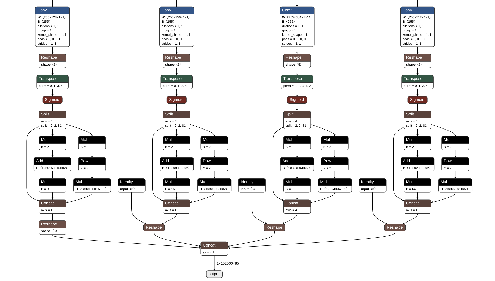
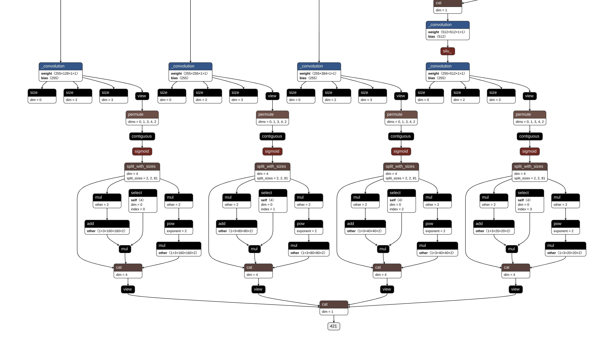
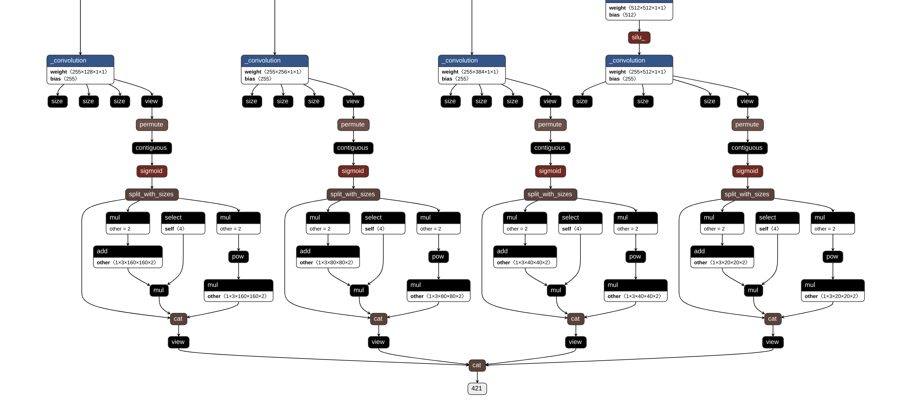

# CV-Lab
Try to decode the detect layers of yolov5 &amp; yolov7, and then realize NMS to the detected objects.

本测试基于Yolov5和 Yolov7，尝试对其输出检测部分 (Detect) 进行解码，多个测试文件在大部分自己实现的功能（绘图，XYWH2XYXY，自己实现class-agnostic的NMS非极大值抑制[^1]等函数）都极大雷同，你可以尝试用一个库将它们合并好，项目需要针对不同的文件放在yolov5或yolov7源代码的根目录下运行，并确保cv2读取的照片路径和模型路径存在。本测试基于Yolov5s6(img-size 1280)和自己训练的Yolov7-tiny-leaky_relu(img-size 1280)，模型本身无所谓，请针对每个测试文件改变imgsz的大小。

[^1]: 注意，两个Yolo默认NMS都没有开启class-agnostic这个选项，但是不论是基于我的项目还是直观感受，class-agnostic的NMS都更符合直觉，就是NMS计算的规模会变化。假设一次NMS对x个目标的时间复杂度为O(f(x))，那么针对总共N个种类，平均每个种类有M个目标的情况下，不开启class-agnostic情况下的平均时间复杂度为O(N\*f(M))，开启class-agnostic情况下的平均时间复杂度为O(f(N\*M))，具体运算变多了还是变少了，就要看f(x)本身时间复杂度是否大于线性时间复杂度，我这里的运算复杂度f(x)是等价log(x)的。

测试尝试解码Yolo输出环节的以下部分，Yolov5和Yolov7在这一部分是大同小异的(我的Yolov7模型只有三个Head而

v5s6有4个)，他们的onnx或torchscript计算图如下，ONNX的图可以更方便的看到输入输出的张量尺寸，其中Identity仅仅表示占位，不含任何张量计算或变换。

每个Head的具体变化流程如下：

1. 在最后一次Conv计算完毕后，会每个头部都会进行一次张量变形Tenser.view或者Reshape，变成[batch=1, anchor=3(每个head三个锚框), 5+nc=85(XYWHC五个量以及各个种类的置信度), Columns, Rows]；其中85表示coco数据集中有nc=80个种类的物体，加上确定物体位置、大小和锚框置信度的XYWHC共5个后正好就是85，我自己训练的模型只有一个类别，故这个维度只有6个尺寸。
2. 然后交换维度torch中是Tensor.permute，在numpy中相同效果的操作就是array.transpose，将[1,3,85,c,r]的张量变为[1,3,c,r,85]。
3. 经过一次sigmoid函数，输出投射到[0, 1]区间。
4. 在第5个维度(dim=4)切分数据流，2+2+81，其中中间的2个表示XY的数据流，他在×2后加上每个网格的坐标偏移值再×stride[i]，即可将xy投影回原图尺寸（stride表示每个头部特征图的下采样步长，例如1280 1280的输入，在stride = 8的特征图预测下，输出的head尺寸就是160×160的，stride = 16的输出是80×80的，以此类推）。右边的2表示WH锚窗高宽的数据流，在*2求平方后，乘以Anchor的尺寸即可还原锚框的宽高，关于这一部分我觉得这两篇文章讲的很好 [文章](http://www.caotama.com/1823086.html) [文章](https://zhuanlan.zhihu.com/p/112574936) 。其余的Confidence和80个种类自己的置信度保留不变，最后保持原来的顺序张量合并，就已经是实际的XYWHC+种类的输出了，作者为了方便NMS，最后将所有的张量展平到二位序列，然后全部拼接在一起，方便输出，所以最后有了102000个输出，实际上102000就是3×160×160，3×80×80，3×40×40，3×20×20的和。

本研究就是希望探究其特征图内部的样子，进行的解开序列，变换并尝试输出，并且使用高维度的张量进行自己实现NMS的过程。

> ONNX
>
> TorchScript
>
> 

## 本项目的测试过程

1. Yolov5的单个Head的单个Anchor的解析，且只分析了一个种类Person的NMS，此处没有使用LetterBox，而是暴力的将图像拉到输入尺寸的大小1280 1280，注意，你可能需要自己修改尺寸以适应自己的模型。
2. Yolov5的单个Head的单个Anchor的解析，且只分析了一个种类Person的NMS，使用LetterBox，但是auto设置为False，会将图片保持比利并使用填充灰边的方式缩放到1280 1280，注意，你可能需要自己修改letter box尺寸、stride以及grid尺寸以适应自己的模型。
3. Yolov5的多个Head的多个Anchor的解析，基于以上的效果，尝试解析所有头部的所有Anchor以及所有种类。
4. 将上述成果转移到Yolov7，并应用了自己的模型，没什么复杂的，注意一些关系即可，如果你需要修改，修改imgsz这个变量以及一些文件路径即可，其余会全自动处理。
5. 后来发现，开启letterbox auto可以减少图片尺寸并减少了神经网络的一些冗余的计算，修改imgsz这个变量以及一些文件路径即可，其余会全自动处理。
6. 将上述yolov7开启letter box的测试结果和流程反过来应用给yolov5，如果你需要修改，修改imgsz这个变量以及一些文件路径即可，其余会全自动处理。

